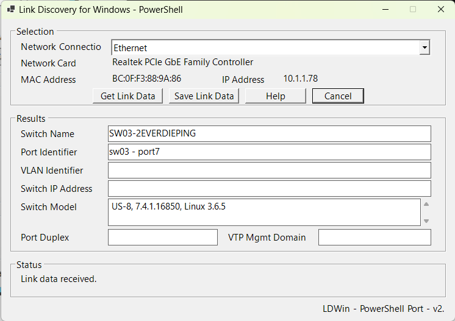
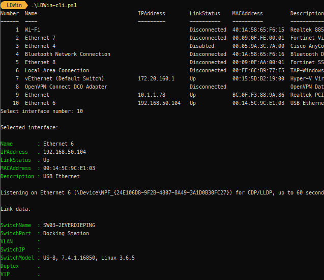

LDWIN
=====
Een port van de originele LDWin.au3 naar PowerShell. ([LDWin van Chris Hall op Github](https://github.com/chall32/LDWin))

Diverse aanpassingen en verbeteringen in het parsen van de data en de opzet van de GUI.

Er is een GUI versie en er is een CLI versie gemaakt. 

De CLI variant is opgezet voor Windows en Linux met `pwsh`

## Screenshot

  


## Wat doet het
Link Discovery is een proces om informatie van een direct connected netwerk device af te kunnen halen, zoals bijvoorbeeld switches.
Het kan je ondersteunen met het troubleshooten van connectie problemen.

LDWin ondersteund de volgende methodes van discovery:

- [CDP](http://en.wikipedia.org/wiki/Cisco_Discovery_Protocol) - Cisco Discovery Protocol
- [LLDP](http://en.wikipedia.org/wiki/Link_Layer_Discovery_Protocol) - Link Layer Discovery Protocol

## Hoe te gebruiken
Je dient administratieve rechten te hebben om dit te kunnen uitvoeren.

### GUI versie

1. Open een PowerShell terminal in privileged mode
2. Start het script `LDWin.ps1` 
3. Kies in de dropdown box "Network Connection:" de netwerk adapter waarvan de informatie wilt opvragen
4. Klik "Get Link Data"
5. LDWin zal dan op de geselecteerde network adapter gaan luisteren naar link protocol aankondigingen. Dit kan tot 60 seconden duren.
6. Als er een aankondiging is ontvangen, wordt de informatie in de Results sectie getoond.
7. Gebruik de "Save Link Data" knop om deze data in een tekst bestand te bewaren.

NOTE: Je hebt geen valide TCP/IP adres nodig om valide link data te ontvangen.

### CLI versie

Gebruik `LDWin-cli.ps1` als commandline variant. Deze versie is handig voor troubleshooting, scripting en als basis voor PowerShell op Linux.

Toon beschikbare interfaces inclusief IP-adres, linkstatus, MAC-adres en omschrijving:

```PowerShell
.\LDWin-cli.ps1 -ListInterfaces
```

Start interactief, toon de interface-lijst en kies daarna een nummer:

```PowerShell
.\LDWin-cli.ps1
```

Start direct op een specifieke interface:

```PowerShell
.\LDWin-cli.ps1 -Interface "Ethernet 6"
```

Gebruik raw output voor troubleshooting van tcpdump of parsing:

```PowerShell
.\LDWin-cli.ps1 -Interface "Ethernet 6" -Raw
```

Pas de timeout aan (default 60 seconden):

```PowerShell
.\LDWin-cli.ps1 -Interface "Ethernet 6" -TimeoutSeconds 90
```

Gebruik een specifieke tcpdump binary:

```PowerShell
.\LDWin-cli.ps1 -Interface "Ethernet 6" -TcpdumpPath "C:\Tools\tcpdump.exe"
```

Op Linux draait de CLI onder `pwsh` met de native `tcpdump` binary:

```bash
sudo pwsh ./LDWin-cli.ps1 -ListInterfaces
sudo pwsh ./LDWin-cli.ps1 -Interface eth0
```

Voor packet capture zijn Administrator/root rechten nodig. Op Windows is Npcap/WinPcap ondersteuning vereist; op Linux moet `tcpdump` geïnstalleerd zijn.
